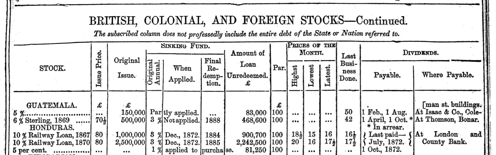
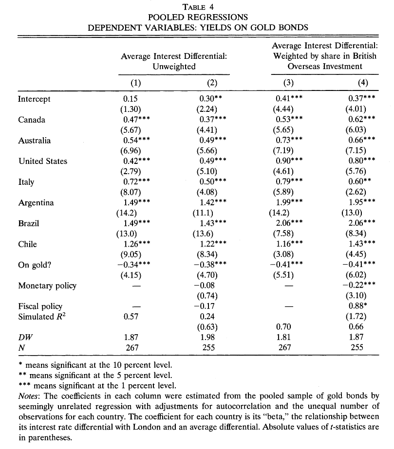
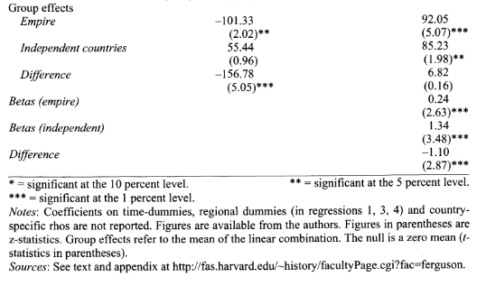

## Today's plan {.smaller}

1.  What are bonds and bond yields?
2.  Bond yields in 19th-century sovereign debt markets
3.  Rival explanations: gold, empire, and the limits of regression

## What is a bond? {.smaller}

-   Bonds are **debt instruments** — a way of borrowing money from investors

-   Key features:

    -   **Nominal amount**: the face value of the bond, expressed in a currency
    -   **Coupon**: the interest payment paid periodically (usually annually or semi-annually)
    -   **Maturity**: the date when the borrower repays the principal

-   Historically, many sovereign bonds were issued in London in sterling (e.g., £100 per bond) and traded on the London Stock Exchange

## Reading a bond price list {.smaller}

{width="700" height="450"}

## Issue price, par, and market price {.smaller}

Take the **Honduras 10% Railway Loan, 1867** as an example:

-   **Par** (£100): the amount Honduras is contracted to repay per bond

-   **Issue price** (£80): what investors paid when the bond was first sold — Honduras's effective borrowing rate was $£10/£80 = 12.5\%$

-   **Market price** (≈£16): what the bond trades for *today* on the LSE — investors buy it from other investors, not from Honduras

-   The denomination (£100) is conventional and not intrinsically important

## The yield {.smaller}

-   The **yield** is the coupon divided by the current market price

-   For the Honduras bond at £16:

$$
\text{yield} = \frac{£10}{£16} = 62.5\%
$$

-   This is a **current yield** (also called a simple yield) — there are more complex *yield-to-maturity* calculations that account for the time until the £100 par value is repaid

-   A high yield signals something important: **will the next coupon actually be paid?**

## Arbitrage and risk-adjusted returns {.smaller}

-   Imagine a British government bond yields **2%** — close to risk-free

-   The Honduras bond yields **62.5%** — why wouldn't every investor buy it?

-   Bond traders tend to equalize **risk-adjusted** returns: you buy the Honduras bond only if, adjusting for default probability, you expect to earn at least as much:

$$
(1 - p_{\text{default}}) \times 62.5\% \ge 2\%
$$

-   Solving: for an investor just indifferent at the current price, $p_{\text{default}} \approx 96.8\%$

-   **High yield** $\Rightarrow$ market prices you as a very high default risk

## Limitations: risk aversion {.smaller}

The framework above is too simple in two ways.
First, **investors are risk-averse**:

-   A certain £100 is worth more than a 50% chance of £0 and a 50% chance of £200 — even though both have the same expected value

-   Losing money now costs you *even more later* because you have less to invest in the next opportunity (see: Kelly betting and volatility drag)

-   As a result, riskier bonds carry a **risk premium** — the yield is somewhat higher than the default probability alone would justify

## Limitations: defaults aren't binary {.smaller}

Second, **default is not an all-or-nothing event**:

-   Most defaulting borrowers reach a **restructured settlement** with bondholders — paying back something, just not everything

-   There are **soft defaults**: paying in a devalued currency, or (for bonds denominated in local currency) inflating away the real value

-   Why is high inflation a form of soft default on a local-currency bond?

-   The full calculation of default probability from market prices is therefore more complex than the simple model

## What bond yields can tell us {.smaller}

Despite these complications, the core insight holds:

-   **Higher yield** $\Rightarrow$ higher market-perceived probability of default (in some form)

-   Default can take many shapes: non-payment, currency abandonment, inflation

-   This makes bond yields a key object of study for understanding **market perceptions of governments**: their stability, macroeconomic policies, currency commitments

-   Caveat: bond yields measure **default risk**, not growth prospects — bondholder interests may not align with broader economic welfare

## The literature on 19th-century sovereign yields {.smaller}

-   Bond yields differ across countries — these differences reflect investor perceptions of **credit-worthiness**

-   A natural question: what factors explain these differences?

-   Two candidates feature prominently in the literature:

    1.  **Gold standard adherence** — did commitment to gold signal fiscal and monetary discipline? [@bordo1996]
    2.  **Empire membership** — did being part of the British Empire substitute for that discipline? [@ferguson2006]

-   A third paper shows that the **regression specification** matters enormously for what we conclude [@accominotti2011]

## Bordo and Rockoff: the gold standard {.smaller}

-   @bordo1996 start from the observation that bond yields vary substantially across countries

-   Their hypothesis: **adherence to the gold standard** was a credible commitment device that reduced borrowing costs

-   What are some possible mechanisms?

-   They test this by regressing sovereign bond yields on country characteristics and a **gold standard dummy** (= 1 if on gold)

## The Bordo-Rockoff regression {.smaller}

{width="420"}

## Interpreting the gold coefficient {.smaller}

-   The "On gold?" dummy takes a value of approximately **−0.4** across specifications

-   This means: being on the gold standard is associated with borrowing costs **0.4 percentage points lower**, holding other country characteristics constant

-   @bordo1996 interpret their findings:

> "Countries that adhered faithfully to the standard were charged rates only slightly above the British consol rate; countries that made only sporadic attempts to maintain convertibility and that altered their parities were charged much higher rates... We interpret these findings to mean that adhering to gold was like the 'good housekeeping seal of approval.'"

## A potential identification problem {.smaller}

-   Is gold standard adherence *really* driving the yield difference, or something else?

-   The countries that most consistently stayed on gold were places like **France, the US, and British colonies like Canada** — already relatively creditworthy

-   Countries that struggled, like **Italy**, inherited severe fiscal problems from unification — independent of their monetary regime

-   This invites a classic concern: **omitted variable bias**

-   Perhaps the same underlying characteristics that made gold adherence easy also made borrowing costs low, independent of gold

## From gold to empire: Ferguson and Schularick {.smaller}

-   @ferguson2006 argue the explanation lies less in gold and more in **empire membership**

-   They acknowledge Bordo and Rockoff, but note the two variables are hard to disentangle: being in the empire also typically meant being on gold — and much more

-   Their key claim:

> "The main inference we draw is that the empire effect reflected the confidence of investors that British-governed countries would maintain sound fiscal, monetary, and trade policies."

-   They replicate Bordo and Rockoff's approach with a **larger sample**, adding a dummy variable for empire membership

## The identification challenge {.smaller}

-   Ferguson and Schularick face a serious challenge:

> "There are only three borrowers in our sample which became (de facto or de jure) colonies within the period: Egypt in 1882, and the Transvaal and the Orange Free State after the Boer War in 1900."

-   Most countries are either always or never in the empire during the sample period

-   This means the "empire effect" is estimated almost entirely from **cross-sectional variation**: comparing yield levels between empire and non-empire countries

-   Why is **within-country** variation (before vs after joining the empire) more convincing than **between-country** comparison?

## Ferguson and Schularick: results {.smaller}

{height="420px"}

## Ferguson and Schularick: conclusions {.smaller}

-   Countries in the British Empire paid approximately **100 basis points (1%) lower** interest rates

-   They conclude:

> "Even when we allow for differences in monetary and fiscal policy, openness to trade, political stability, as well as geographical location and level of economic development, we find that a country that was a part of the British Empire was still able to borrow at significantly lower interest rates than one that was not."

-   They argue **India** was the main beneficiary — the empire effect cut risk premia for poor and underdeveloped parts of the empire

## Accominotti et al.: revisiting the regression {.smaller}

-   @accominotti2011 revisit @ferguson2006 and argue the regression specification is **fundamentally flawed**

-   The critique is conceptual but maps directly onto the dummy variable approach

-   Both earlier papers model empire as:

$$
\text{yield}_{it} = \alpha + \beta_1 \text{Empire}_i + X_{it} + \epsilon_{it}
$$

-   The empire dummy shifts the intercept: colonies get a **constant discount** on borrowing costs, other things equal

-   @accominotti2011 challenge this: "it is not possible to move between sovereignty and colonial status while keeping other things equal"

## The problem with dummy variables {.smaller}

-   @accominotti2011 identify a critical assumption embedded in the dummy variable approach:

> "...a critical assumption of this methodology is that the institution under scrutiny has a constant marginal effect on the variable that it is supposed to be influencing. In many cases this does not hold. 'Institutions' do not have a marginal effect, but a structural one."

-   What does "constant marginal effect" mean here?

-   The regression assumes that the relationship between **yields and debt burden** (or any other fiscal variable) is the **same for colonies and sovereign states** — empire just shifts the level

-   Accominotti et al. argue this is wrong

## What the dummy variable assumes about investors {.smaller}

-   @accominotti2011 spell out the implicit investor model:

> "...it is assumed that investors thought of British colonies in essentially the same way as they thought of sovereign countries; that is, they priced them according to the very same formula, involving the same variables. Then in a second stage, investors applied a bonus and traded colonies at a higher price... The second stage reduction in interest rates is the so-called 'empire effect', and it is measured 'other things being equal'."

-   By analogy: this would be like mixing the debt pricing of a **local council** and a **sovereign state** in the same regression, then adding a dummy for council/state

## The key figure {.smaller}

![Default probability vs debt burden for colonies and sovereign states [@accominotti2011, Figure 1]](images/accominotti_fig1.png){height="450px"}

## Interpreting the key figure {.smaller}

-   The y-axis shows a **default probability** derived from bond yields (a way of putting all yields on a 0–1 scale)

-   The x-axis shows the **debt burden**: interest payments divided by government revenue

-   **Sovereign states** (one colour): a strongly positive relationship — higher debt burden $\Rightarrow$ higher default risk

-   **Colonies** (other colour): a **flat** relationship — debt burden is essentially unrelated to default risk

-   Interpretation: nobody cares what India's debt burden is if the British government will cover its obligations; everybody cares what Italy's debt burden is

## Regression results by group {.smaller}

![Coefficients estimated separately for colonies and sovereign states [@accominotti2011, Table 3]](images/accominotti_table3.png){height="450px"}

## Accominotti et al.: conclusions {.smaller}

-   @accominotti2011 conclude:

> "The Empire made the spread paid by subject countries insensitive to their performance because credibility was decided elsewhere. You would not look in India for indications of India's credit. More likely, you would look at Downing Street. The effect of empire was not to provide subjects with a marginal interest rate benefit but to remove the default risk altogether."

-   If the *price* was subsidised by the imperial core, we should look at **quantities**: who was actually allowed to borrow, and how much?

## Who benefited from the imperial subsidy? {.smaller}

![Borrowing by settler vs dependent colonies [@accominotti2011]](images/accominotti_settler.png){width="500" height="307"}

-   It was predominantly **settler colonies** that borrowed beyond their fundamentals — not the dependent colonies
-   Following Davis and Huttenback: dependent colonies benefited little if at all relative to self-governing colonies

## What do we think? {.smaller}

-   Do we think the gold standard or policies linked to empire are better explanations of the variation in bond yields?

-   Do we agree with the criticisms of @accominotti2011 that the dummy variable approach to institutions is mis-specified?

-   How do we map the @accominotti2011 critique onto a warning about the limits of regression analysis?

## Bibliography
