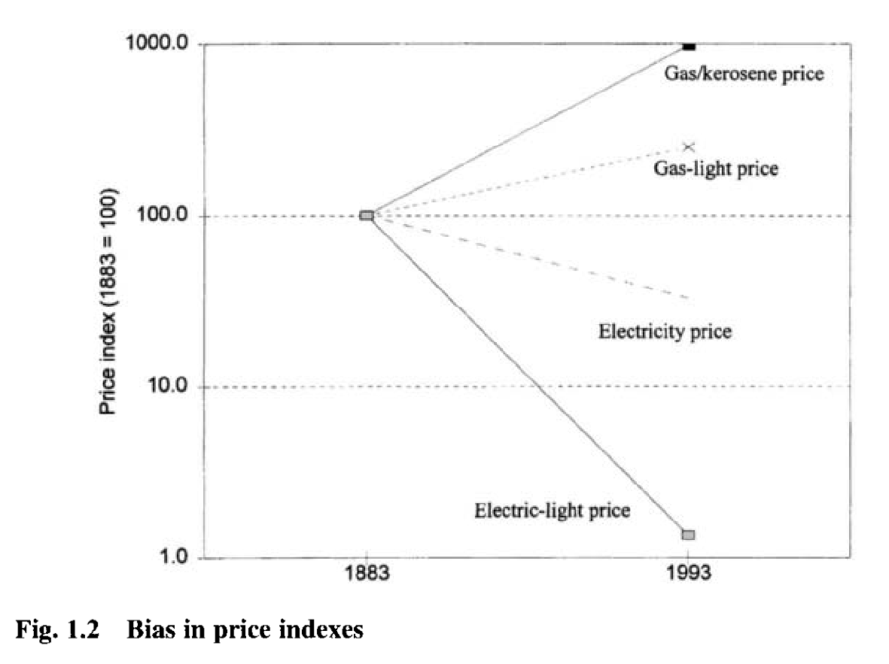
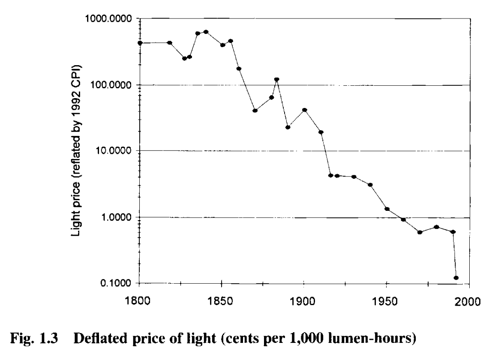
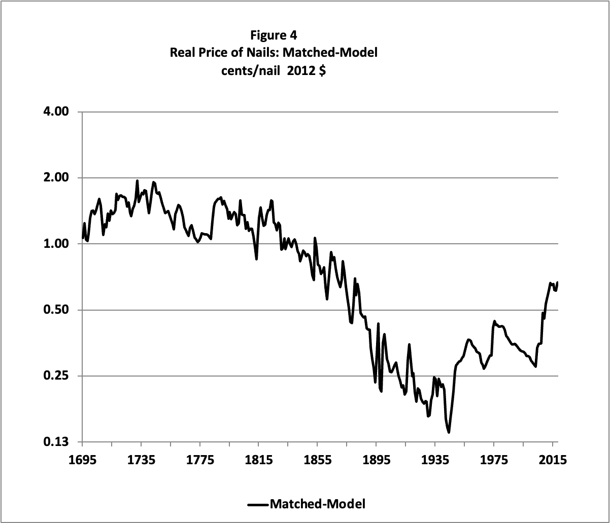

## Today's plan {.smaller}

1.  The origins and purpose of GDP
2.  Data quality: what do we actually know about GDP?
3.  Hedonic pricing: measuring the price of services, not goods
4.  Exercise: the price of nails

## What is GDP? {.smaller}

-   GDP measures a **flow** of economic activity within a particular **location** over a particular **period of time**

-   Three equivalent approaches to measurement:

    1.  **Expenditure**: sum of all spending on final goods and services — $C + I + G + (X - M)$
    2.  **Income**: sum of all incomes earned in production
    3.  **Output**: sum of value added at each stage of production

-   In principle all three give the same number; in practice they diverge

-   **Summary point**: GDP is primarily a **tool** for economic planning not a measure of welfare

## Early modern precursors {.smaller}

-   @coyle2014 opens with the claim that "GDP is one of the many inventions of World War II" 

Early precursors: 

-   **William Petty (1660s)**: estimated English income, expenditure, population, and assets — explicitly to show England could finance war against Holland and France

-   **Charles Davenant**: similar exercises in England

-   **Jacques Necker (France)**: national accounting geared towards showing the ruler the fiscal capacity of the state for war

-   These early efforts are instruments of **statecraft**, usually for war

## Conceptualizing national income {.smaller}

-   Adam Smith drew a sharp line between productive and unproductive labour in *The Wealth of Nations*:

> There is one sort of labour which adds to the value of the subject upon which it is bestowed: There is another which has no such effect. … The labour of a menial servant, on the contrary, adds to the value of nothing. … A man grows rich by employing a multitude of manufacturers: He grows poor, by maintaining a multitude of menial servants.

-   Excludes much of **services** from national income

-   The prejudice was echoed by Marx; the Soviet Union "largely ignored service activities" [@coyle2014]

-   By the late 19th century, Alfred Marshall and others pushed for an **expansive view** closer to modern usage

## Interwar institutionalisation {.smaller}

-   National income estimation became more formalised in the interwar period, linked to understanding the economic crises of the time

-   **UK**: Colin Clark produced national income and expenditure estimates; appointed in 1930 to the National Economic Advisory Council

-   **US**: Simon Kuznets worked under President Roosevelt to adapt these methods; his first report to Congress in 1934 estimated national income had **halved** between 1929 and 1932

-   This offered a far more complete picture than what Hoover had been working with: scattered industrial statistics and share prices

## Kuznets: welfare vs output {.smaller}

-   Kuznets recognised he was producing an **output series**, but thought **welfare** was the more important and interesting problem

-   He wrote in 1937:

> It would be of great value to have national income estimates that would remove from the total the elements which … represent dis-service rather than service. Such estimates would subtract … all expenses on armament, most of the outlays on advertising … and what is perhaps most important, the outlays that have been made necessary in order to overcome difficulties that are, properly speaking, costs implicit in our economic civilization.

-   This was not what the US government wanted [@coyle2014]

## The wartime battle {.smaller}

-   By the late 1930s the US government needed national accounts that showed **productive capacity for war** — and that **included government expenditure** as part of output

-   Earlier definitions generally excluded government spending; as government expanded at the expense of the private economy, GDP would appear to *shrink*

-   The first official American GNP statistics (1942) included government expenditure and were designed to analyse the burden of the war

-   Kuznets remained skeptical: including government spending "tautologically ensured that fiscal spending would increase measured economic growth regardless of whether it actually benefited individuals' welfare" [@coyle2014]

## The conceptual shift {.smaller}

-   The modern settlement: government consumption is included in GDP.

-   Given government consumption is around 18% of GDP in modern OECD countries this is a big difference, and sensible to include

-   But Kuznets's point has force: a $1 billion bridge to nowhere is measured by its **cost** — an input measure, not a welfare measure

-   Some economists have argued that Chinese GDP growth has similar cost/output issues

-   GDP measures **economic activity**, not **welfare** 

## GDP as empirical construct {.smaller}

-   Richard Stone, a pioneer of national accounts in the UK, emphasised that GDP is a **theory-laden construct**, not a fact [@coyle2014]:

> To ascertain income it is necessary to set up a theory from which income is derived as a concept by postulation and then associate this concept with a certain set of primary facts.

-   Different theoretical frameworks would yield quite different measures

-   The UN System of National Accounts states explicitly that the accounting framework "is designed for purposes of **economic analysis, decision-taking and policymaking**" — not welfare

-   Two key features: (1) theory-dependent, (2) geared to economic management, not welfare measurement

## Beyond GDP {.smaller}

-   Recognition of GDP's limits has prompted alternatives aimed more explicitly at **welfare**

-   **Stiglitz-Sen-Fitoussi Commission (2009)**: recommended supplementing GDP with measures of inequality, sustainability, and subjective well-being

-   **Human Development Index (HDI)**: Amartya Sen and Mahbub ul Haq — combines income, health, and education; used by UNDP

-   These are important but raise their own deep measurement problems: how do you combine health and income into a single index?

-   Different question: **how well GDP itself is measured**

## Jerven: the veneer of accuracy {.smaller}

-   @jerven2013 argues that GDP statistics for sub-Saharan Africa present a **veneer of greater accuracy** than is warranted

-   The answer to "what do we know about income and growth in sub-Saharan Africa?" is "much less than we like to think"

-   The core issue: where to place the **production boundary** — what counts as economic activity?

-   Pigou's famous example: if you marry your cook, what happens to GDP?

-   The boundary is a **conceptual choice**, not a natural fact — and different choices yield very different numbers

## The base year problem {.smaller}

-   To measure **real** (inflation-adjusted) GDP you need a base year in which prices are held constant

-   The base year also defines the **sectoral weights**: the relative size of agriculture, industry, services, etc.

-   As sectors grow at different rates and relative prices shift, the base-year weights become increasingly misleading

-   **IMF best practice**: rebase every five years — but this is rarely followed in low-income countries due to cost

-   Consequence: GDP figures reflect the structure of the economy in the base year, not today — introducing systematic **bias**

## Ghana's GDP revision {.smaller}

-   Ghana was using **1993 as the base year** until the mid-2000s

-   In 2010 they updated the base year to 2006 sector weights and prices

-   Result: measured GDP jumped from **cedi 21.7 billion** (old base) to **cedi 36.9 billion** (new base) — nearly doubling overnight

-   One concrete problem with the 1993 base: 

    -   Ghana has a large and growing telecoms sector — but its contribution was measured using 1993 landline-era weights and prices
    -   The mobile phone revolution was essentially invisible in the old accounts

-   @jerven2013: the statistics are not fabricated but unreliable, and costs of collection result in very variable quality

## The core measurement problem {.smaller}

-   Even if data collection is perfect, price indices face a deeper challenge: they track the **prices of goods**, not the **prices of the services those goods provide**

-   @nordhaus1997:

> For many practical reasons, traditional price indexes measure the prices of goods that consumers buy rather than the prices of the services that consumers enjoy.

-   This matters whenever goods **change quality** or are **replaced by new products**

    -   A laptop in 2025 and a laptop in 1995 are both called "a laptop" — but they are radically different objects
    -   Tracking the price of "a laptop" misses the enormous improvement in computing services per dollar

-   **Hedonic pricing** (from the Greek *hedone*, pleasure): price the bundle of services goods provide, not the goods themselves

## Nordhaus: measuring the price of light {.smaller}

-   @nordhaus1997 chooses a deliberately simple case: the price of **illumination**

-   People do not want candles, whale oil, kerosene, or electricity — they want **light**

-   The service can be measured cleanly: **lumens per watt** — units of illuminance per unit of energy input

-   This allows Nordhaus to track the *price of the service* rather than the *price of the energy source*

-   The key insight: as technology changes (candles → gas → electricity → LEDs), traditional price indices track a shifting set of goods; Nordhaus tracks a fixed service

-   Result: the true fall in the cost of light is **far larger** than traditional price indices suggest

## Bias in price indexes {.smaller}

{height="450px"}

## The price of light over time {.smaller}

{height="450px"}

## The labour-hours measure {.smaller}

-   Nordhaus extends the hedonic argument by expressing the cost of light in **labour hours**:

> One modern one-hundred-watt incandescent bulb burning for three hours each night would produce 1.5 million lumen-hours of light per year. At the beginning of the last century, obtaining this amount of light would have required burning seventeen thousand candles, and the average worker would have had to toil almost **one thousand hours** to earn the dollars to buy the candles. [@nordhaus1997]

-   Not only is light much cheaper — the time we must devote to earning it has fallen even further

-   **Modern practice**: US statistical agencies now "quality-adjust" price indices — a new car's price is adjusted for mileage, safety features, fuel efficiency — tracking the *services* the car provides, not just its sticker price

-   This remains contested and difficult: how do you price all the services bundled in a smartphone?

## The nail price exercise {.smaller}

-   We now work through a similar exercise using the **price of nails** [@sichel2022]

-   What kinds of services do nails provide?

-   The data: real price of a nail in 2012 US cents, 1695–2019

    -   Source: Sichel (2022), matched-model index (column PRMATCHCN)
    -   Splices together hand-forged, cut, and wire nail price series

{height="300px"}

## A history of nail technology {.smaller}

| Period | Technology | Key change |
|---|---|---|
| Roman era – 1820 | **Hand-forged** | ~1 minute per nail by a nailsmith |
| 1790s – 1890s | **Cut nails** | Machine-cut from iron/steel sheet; steam-powered rolling mills |
| 1880s – 1920 | **Wire nails** | Drawn from wire; 300–450/min by machine |
| Early 1980s | **Pneumatic nail guns** | First appear in Sears catalogue |
| Today | Fully automated | Some machines: 2,000 nails/minute |

*Note: the 1880s–1890s saw overlapping use of cut and wire nails during the transition period.*

-   What does this imply for a traditional price index vs a hedonic one?

## Exercise {.smaller}

Open the data file: [nail_prices.xlsx](https://github.com/gabrielfgm/methods-in-economic-history/blob/main/nails-exercise/nail_prices.xlsx)

The spreadsheet contains: **Year** and **Real_Price_Cents_Per_Nail_2012USD** (Sichel's matched-model index, column PRMATCHCN)

**Questions to consider:**

1.  What **services** do nails provide? 

2.  Have those services **changed**? 

3.  If you were constructing a **hedonic price index** for nails, what unit of service would you use — analogous to Nordhaus's lumen-hours per dollar?

4.  Do you think a hedonic adjustment would make the price fall look *larger* or *smaller* than the raw series? Why?

5. Construct an ad-hoc adjustment based on assuming changes in the quantity of the service provided by nails to the existing price series to get a new 'hedonic' price series.

## Bibliography
