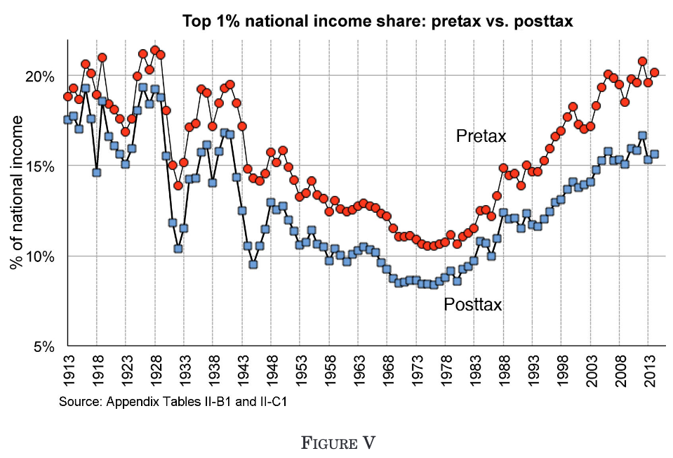
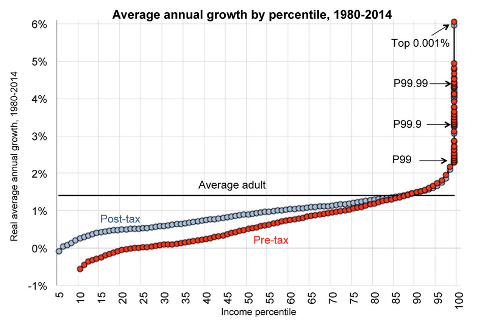
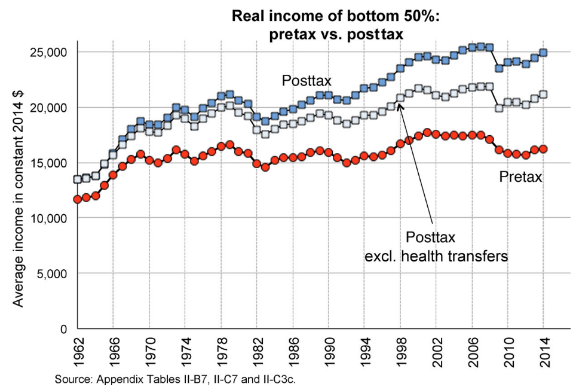
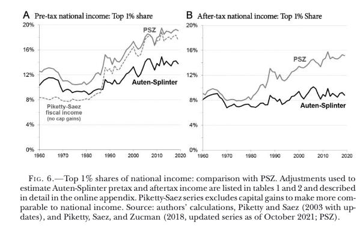

## Today's Plan

1.  Definitions: Gini coefficient and top income shares
2.  Survey approaches and their limits
3.  The PSZ approach: Distributional National Accounts
4.  The hard parts: tax incidence, government spending, capital income
5.  PSZ vs. AS: the evasion debate
6.  Discussion questions

# Part 1: What is inequality and how do we measure it?

## How to measure inequality? {.smaller}

::::: columns
::: {.column width="80%"}
```{r}
library(ggplot2)
library(dplyr)
library(tidyr)

# Set seed for reproducibility
set.seed(42)

# 1. Define Population
N <- 100

# 2. Generate Distributions
# Scenario A: Low Inequality (Normal Distribution)
income_low <- abs(rnorm(N, mean = 100, sd = 50))

# Scenario B: Extreme Inequality (99 poor, 1 super rich)
income_extreme <- c(rep(1, N-1), 1000)

# 3. Function to Calculate Data & Gini
process_scenario <- function(income, name) {
  income <- sort(income)
  cum_pop <- c(0, (1:length(income)) / length(income))
  cum_inc <- c(0, cumsum(income) / sum(income))

  # Calculate Gini
  auc <- sum(diff(cum_pop) * (head(cum_inc, -1) + tail(cum_inc, -1))) / 2
  gini <- round(1 - (2 * auc), 3)

  data.frame(
    Cum_Pop = cum_pop,
    Cum_Income = cum_inc,
    Label = paste0(name, " (Gini: ", gini, ")")
  )
}

# 4. Combine Data
df_plot <- bind_rows(
  process_scenario(income_low, "Low Inequality"),
  process_scenario(income_extreme, "Extreme Inequality")
)

# 5. Define the Total Area Triangle (Denominator of Gini)
total_area_triangle <- data.frame(
  x = c(0, 1, 1),
  y = c(0, 1, 0)
)

# 6. Plot
ggplot() +

  # LAYER 1: The Total Reference Area (Background Triangle)
  # This represents the total area under the Line of Equality (Area = 0.5)
  geom_polygon(data = total_area_triangle, aes(x = x, y = y),
               fill = "grey90") +

  # LAYER 2: The Inequality Gap (Numerator of Gini)
  # Shading between the curve and the diagonal
  geom_ribbon(data = df_plot,
              aes(x = Cum_Pop, ymin = Cum_Income, ymax = Cum_Pop, fill = Label),
              alpha = 0.5) +

  # LAYER 3: The Lorenz Curves
  geom_line(data = df_plot,
            aes(x = Cum_Pop, y = Cum_Income, color = Label),
            linewidth = 1) +

  # LAYER 4: The Line of Equality (Diagonal Reference)
  geom_abline(intercept = 0, slope = 1, linetype = "dashed", color = "gray40") +

  # Formatting
  scale_x_continuous(labels = scales::percent, name = "Cumulative Share of Population", expand = c(0,0)) +
  scale_y_continuous(labels = scales::percent, name = "Cumulative Share of Income", expand = c(0,0)) +

  scale_fill_manual(values = c("firebrick", "steelblue")) +
  scale_color_manual(values = c("darkred", "navy")) +

  labs(
    title = "Lorenz Curves & Gini Coefficient",
    subtitle = "Grey Triangle: Total Area (Denominator)\nColored Area: Inequality Gap (Numerator)",
    fill = "Scenario",
    color = "Scenario"
  ) +

  theme_minimal() +
  theme(
    legend.position = "bottom",
    plot.title = element_text(face = "bold", size = 16),
    panel.grid.minor = element_blank()
  ) +
  coord_fixed()

```
:::

::: {.column width="20%"}
-   The Gini coefficient measures how far the observed income distribution departs from perfect equality
-   You need to know the *full distribution*
:::
:::::

## Measuring inequality: Gini

-   If you have full distributions of income/wealth it is straightforward to calculate the Gini as a summary statistic.

-   Depends strongly on the reference population: cohort, country, world?

[Consider where you are in global income/wealth](https://wid.world/income-comparator/)

## Top X% incomes? {.smaller}

-   Common to see inequality measured as the percent of income/wealth held by the top 0.1/1/10%, e.g. @alvaredo2013

-   This only requires detailed knowledge of:

    -   Aggregate wealth/income

    -   The percentage of aggregate held by this percentile

-   **Still really difficult**

## Survey Approaches: Problems {.smaller}

-   Most detailed income data comes from household surveys (e.g. Current Population Survey in the US)

-   Key problems at the top of the distribution:

    -   **Top-coding**: surveys cap reported income at a maximum to protect privacy — top earners all look the same
    -   **Non-response**: the very wealthy disproportionately refuse to participate
    -   **Sampling error**: with very few billionaires, missing one person can dramatically shift estimates
    -   **Under-reporting**: even when surveyed, the rich under-report income

-   These problems bias surveys *downward* for top income shares

-   Motivation: use administrative tax records instead

# Part 2: Distributional National Accounts (PSZ)

## The PSZ Approach {.smaller}

-   @piketty2018 seek to allocate *all* of national income to individuals

-   Two-step process:

    1.  Start with the national accounts (GDP): a comprehensive measure of all income in the economy
    2.  Allocate that income to individuals using micro-level tax files

-   The IRS data is very large reducing sampling error compared to surveys

-   Goal: produce *distributional national accounts* — who gets what share of the national income as reported in national accounts

## Pre-tax vs. Post-tax Income {.smaller}

-   **Pre-tax income**: factor income plus social insurance benefits, before taxes and most transfers

    -   What you earn before the government redistributes anything

-   **Post-tax income**: pre-tax income minus taxes, plus all government transfers

    -   Includes money transfers (EITC, social security), in-kind transfers (Medicare, Medicaid), and an allocation of public goods

-   The gap between the two series measures the redistribution achieved by the state

-   Both series are informative: pre-tax tells us about market outcomes, post-tax about living standards

## Top 1%: Pre-tax vs. Post-tax {.smaller}



PSZ, Figure V

-   Pre-tax top 1% share has risen sharply since 1980
-   Post-tax share has risen less — redistribution compresses the distribution
-   But redistribution has not kept pace with pre-tax divergence

## Growth by Percentile, 1980–2014 {.smaller}



-   Post-tax growth is more equal than pre-tax growth across the full distribution
-   But even post-tax, income growth is heavily concentrated at the very top

## Bottom 50%: Pre-tax vs. Post-tax {.smaller}



-   Post-tax income for the bottom 50% has grown
-   Pre-tax income has grown substantially less

# Part 3: The Hard Parts

## The Allocation Problem {.smaller}

-   National income $\neq$ sum of all tax returns and individual income $\neq$ earnings.

-   PSZ must make judgments about three main categories of "missing" income:

    1.  **Tax incidence**: who really bears the burden of taxes?
    2.  **Government spending**: whose income is public expenditure?
    3.  **Capital income**: imputed values that don't show up as cash flows

-   Every choice here is contested and affects where in the distribution income ends up

## Tax Incidence {.smaller}

::: incremental
-   Who really pays a tax depends on market structure, not who writes the cheque

-   **E.g. Payroll tax**: PSZ assume borne by employees (reduces wages), not employers

-   **Corporate income tax**: contested — borne by shareholders?
    All capital owners?
    Workers through lower wages?

-   **Tariffs on inputs**: borne by importers, or passed on to consumers as higher prices?

-   These are genuine empirical questions without consensus answers — economists work on estimating tax incidence
:::

## Government Spending: Easy to Hard {.smaller}

| Category | Example | How PSZ Allocate |
|------------------------|------------------------|------------------------|
| Money transfers | EITC, social security | Directly to recipients |
| In-kind transfers | Medicare, Medicaid | To programme beneficiaries (usually at cost) |
| Public goods | Defence, roads, justice | Proportional to post-tax income |
| Deficit spending | — | 50% ↑ taxes / 50% ↓ transfers |

-   The public goods row is where the biggest judgments sit: *"Given that we know relatively little about who benefits from spending on defense, police, the justice system, infrastructure, and the like, this seems like the most reasonable benchmark."* [@piketty2018]

-   AS allocate public goods half per-capita, half proportional to after-tax income

## Capital Income: Imputed Values {.smaller}

::: incremental
-   Some capital income does not appear on tax returns as a cash flow:

    -   **Owner-occupied housing**: you implicitly earn rent by living in your own home (*imputed rent*)
    -   **Retained corporate earnings**: profits kept inside a firm — shareholders benefit but receive no cash distribution
    -   **Pension funds**: investment returns accumulate tax-deferred and appear only at withdrawal

-   PSZ impute these values and allocate them to individuals

-   Each imputation requires assumptions about *who owns what*

-   Small changes in ownership assumptions at the top can substantially shift top income shares
:::

# Part 4: PSZ vs. AS

## The Debate: Where Does Unallocated Income Go? {.smaller}

::: incremental
1.  Start with the national accounts: all income in the economy

2.  Allocate national income to individuals using tax returns

3.  A large residual remains — income that does not appear on any return:

    -   Tax evasion
    -   Imputed capital income
    -   Government spending not allocated to individuals

4.  Make a series of judgments about how to distribute the residual

5.  The key disagreement: @piketty2018 allocate more of the residual to the top of the distribution; @auten2024 allocate more to the middle and bottom
:::

## PSZ vs. AS: How Different? {.smaller}



@auten2024, Figure 6

-   The gap is large: AS find the top 1% share roughly half what PSZ report for posttax
-   The single biggest driver is how each study allocates income not appearing on tax returns — above all, tax evasion

# Part 5: The Evasion Problem

## Tax Evasion: A Measurement Problem {.smaller}

-   PSZ and AS disagree most on **how much tax evasion occurs, and where in the distribution**

-   Recent work by @guyton compare random audits to targeted enforcement operations and tax amnesty programmes

-   Their finding: substantial evasion concentrated at the top of the distribution

-   AS dispute the magnitude of these estimates

-   But the deeper problem is structural: tax evasion is **partially observed data**

## Partially Observed Data {.smaller}

We never observe whether someone evaded — only whether they were *caught*:

| Person      | True Fraud | Detected | Observed Fraud |
|-------------|------------|----------|----------------|
| 1           | 1          | 0        | 0              |
| 2           | 0          | 1        | 0              |
| 3           | 1          | 1        | 1              |
| ...         | ...        | ...      | ...            |
| N           | 1          | 0        | 0              |
| **Average** | **50%**    | **50%**  | **25%**        |

$$P(\text{Observed Fraud}) = P(\text{True Fraud}) \times P(\text{Detected})$$

Seeing no recorded fraud tells us only that a person was never *caught* — not that they never evaded.

## Detection Controlled Estimation {.smaller}

-   Econometricians model both components simultaneously @feinstein1990 building on ideas from @poirier1980:

$$P(\text{Observed}) = P(\text{Fraud}) \times P(\text{Detect | Fraud})$$

-   Estimate the model using observable characteristics to separately identify the fraud rate and the detection rate

-   Clever but **fragile**: identification rests on functional form assumptions that cannot easily be tested

-   In computer science / machine learning the same problem is called *positive and unlabelled learning* — a large literature on handling it has grown up independently

# Discussion Questions

## Discussion: Healthcare and Inequality {.smaller}

> The US government succeeds in negotiating down the prices of medical services provided to Medicare and Medicaid.
> What happens to measured inequality under the distributional national accounts framework?

## Discussion: War, Taxes, and Inequality {.smaller}

> The US raises taxes substantially to fund increased military expenditure.
> Would this affect measured inequality?
> Would the effect differ between the PSZ and AS approaches?
> Which approach would you favour, and why?

## Works Cited
